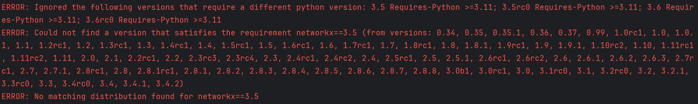

# AI小说生成器工具测试的步骤和可能遇到的问题

> 本文将手把手教你如何在实际使用**基于大语言模型的自动小说生成工具**之前测试工具的各个模块。
>

---

## 1.  LLM Model Settings

GUI界面详解

点击**新增** → 创建新的模型配置
点击**重命名** → 修改当前配置名称
点击**删除** → 移除该配置
点击**保存** → 保存当前设置参数
**APIKey**：在 DeepSeek 官网或 OpenAI 官网生成对应的 API Key，复制到输入框中
**BaseURL**：找找官方文档的API使用，将相应的baseurl复制过来即可
示例：
| 服务        | Base URL                        |
| DeepSeek  | `https://api.deepseek.com/v1`   |
| OpenAI    | `https://api.openai.com/v1`     |
**接口格式**：根据API的来源进行选择，大多数有OpenAI的兼容
**模型名称**：指定你希望使用的 LLM 的名称，具体请从官方文档中寻找自己需要的模型名称
示例：deepseek-chat
deepseek-reasoner
gpt-4o-mini
qwen2.5-7b-instruct
**Temperature**：| Temperature | 输出特点              |
| ----------- | ----------------- |
| 0.0–0.3     | 严谨、确定性高，适合一致性检查   |
| 0.4–0.7     | 平衡创意与稳定性（小说生成推荐）  |
| 0.7–1.0     | 更丰富、有想象力，但风险是逻辑偏离 |
**Max Token**：控制单次生成文本的最大长度。
越大代表模型能一次生成更多内容。
设太小 → 文本生成被截断
设太大 → 调用成本上升、部分模型无法支持
**Timeout**：请求模型时的最大等待时间，避免长时间卡死。推荐网络正常：30–60秒，大模型 + 超长生成：300–600秒


==测试错误合辑==
| 错误提示               | 原因           |
| `401 Unauthorized` | Key填错/已失效 | 
| `Invalid API Key`  | 使用了错误平台的Key | 
| 请求无响应              | Key额度用完     | 
| `404 Not Found`   | Base URL 写错路径，如少了 `/v1`     |
| `ConnectionError` | 墙、代理、无网络、服务挂了               |
| 返回 HTML 页面        | Base URL 指向了错误网址（不是API入口） |
| 返回 `Invalid URL structure` | 接口格式和 Base URL 不匹配      | 
| 测试配置失败但Key 正常             | DeepSeek协议与OpenAI不兼容 | 
| `model_not_found` | 模型名称拼写错误或该服务商不存在该模型 |
| `403 Forbidden`   | API Key 无访问该模型的权限   |

---

## 2. 下载项目源代码

你可以使用Git下载项目，也可以从GitHub直接获取压缩包。
==额外的报错情况：如果遇到openai.BadRequestError: Error code: 400 - {'error': {'message': '<400> InternalError.Algo.InvalidParameter: Value error, contents is neither str nor list of str.: input.contents', 'type': 'InvalidParameter', 'param': None, 'code': 'InvalidParameter'}, 'id': '9515af7c-c156-4a38-9c75-2724b2e63a37', 'request_id': '9515af7c-c156-4a38-9c75-2724b2e63a37'}这种类型的报错请按照以下步骤修复==
1.打开项目里的 embedding_adapters.py
2. 找到self._embedding = OpenAIEmbeddings那一段初始化代码
3.在参数里加上：check_embedding_ctx_length=False，形如
```python
self._embedding = OpenAIEmbeddings(
    api_key=api_key,
    base_url=base_url,
    model=model_name,
    check_embedding_ctx_length=False, 
)
```
4.保存文件，重启你的GUI，再点一次测试Embedding配置
### ✔ 方法一：使用Git克隆仓库

打开IDE后（例如PyCharm/VSCode/云端环境，本文使用的是PyCharm）在终端输入以下命令

```bash
git clone https://github.com/YILING0013/AI_NovelGenerator
```
将项目代码克隆到本地/云端
### ✔ 方法二：直接下载ZIP

在 GitHub 项目主页点击 **“Download ZIP”** 解压后即可。

---

## 3. Windows用户可能需要安装C++构建工具（可选）

部分依赖库需要编译。如果安装过程中出现无法构建某些包的情况，可以安装：

**Visual Studio Build Tools**：
[https://visualstudio.microsoft.com/zh-hans/visual-cpp-build-tools/](https://visualstudio.microsoft.com/zh-hans/visual-cpp-build-tools/)
建议下载，本文已经下载

安装时务必勾选：

* ✔ **C++ 桌面开发**

（默认只安装 MSBuild，无法满足依赖编译需求）

---

## 4. 安装依赖

重新打开IDE的终端，先进入项目目录

```bash
cd AI_NovelGenerator
```

然后在终端通过pip工具安装配置文件中的依赖：

```bash
pip install -r requirements.txt
```

如果出现某些包漏装，可以手动补装：

```bash
pip install <包名>
```
### 在此步骤中可能出现的问题

==很可能是没有激活虚拟环境，在IDE中使用
```bash
source venv/Scripts/activate
```
激活环境，其中venv这个路径需要根据自己的虚拟环境创建的位置看情况修改==
---

## 5. 启动主程序（GUI）

安装完成后，运行主程序：

```bash
python main.py
```

这会启动图形化界面，你可以可视化地设置参数、生成设定、生成小说章节。

---

## 6. 基础配置说明（config.json）

程序会读取 `config.json` 用来配置模型、API Key与小说生成参数。
示例配置如下（来自README）：

```json
{
    "api_key": "sk-XXXXXXXXXXXXXXXXXXXXXXXXXXXXXX",
    "base_url": "https://api.openai.com/v1",
    "interface_format": "OpenAI",
    "model_name": "gpt-4o-mini",
    "temperature": 0.7,
    "max_tokens": 4096,
    "embedding_api_key": "sk-XXXXXXXXXXXXXXXXXXXXXXXXXXXXXX",
    "embedding_interface_format": "OpenAI",
    "embedding_url": "https://api.openai.com/v1",
    "embedding_model_name": "text-embedding-ada-002",
    "embedding_retrieval_k": 4,
    "topic": "示例主题",
    "genre": "玄幻",
    "num_chapters": 120,
    "word_number": 4000,
    "filepath": "D:/AI_NovelGenerator/filepath"
}
```

---

## 7. 本地模型用户（Ollama）注意事项

如果你使用本地模型作为 Embedding，启动命令为：

```bash
ollama serve
ollama pull nomic-embed-text
```

建议切换模型后手动清空项目 `vectorstore/` 文件夹，以避免旧向量影响剧情一致性。

---

## 8. 可选：打包为可执行文件（免Python环境）

如果你希望在没有Python的电脑上使用，可以通过PyInstaller打包：

```bash
pip install pyinstaller
pyinstaller main.spec
```

打包完成后，程序位于：

```
dist/main.exe
```

---

## 9. 安装完成后你可以做什么？

图形界面提供四步式操作：

1. **生成世界观与角色设定**
2. **生成完整章节目录（剧情蓝图）**
3. **生成章节草稿（自动检索设定）**
4. **章节定稿（更新角色状态与全局摘要）**

并提供一致性审校工具，适合写长篇小说的场景。

---

## 总结

现在你已经完成了：

✔ 下载项目
✔ 安装环境与依赖
✔ 配置模型与参数
✔ 启动 GUI 编辑器
✔ 可选：打包为EXE